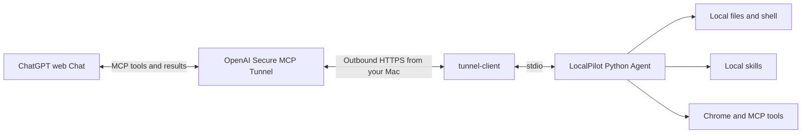

# LocalPilot

**English** · [简体中文](README.zh-CN.md)

**Local AI coding, straight from ordinary ChatGPT web Chat.**

Let ChatGPT read your project, load local skills, edit code, run tests, and bring the actual results back into the conversation. LocalPilot uses the model already available in your Chat. It does not start Codex, require Work mode, or initiate additional model-generation API calls.

[Quick start](#quick-start) · [Features](#what-it-can-do) · [Tunnel guide — 中文](docs/TUNNEL.zh-CN.md) · [Configuration — 中文](docs/USAGE.zh-CN.md) · [Verification — 中文](docs/VERIFICATION.zh-CN.md)


*The actual LocalPilot component, rendered with labeled public demo data. This is a UI demonstration, not a ChatGPT conversation transcript.*

## Why LocalPilot?

Want to fix a local project without setting up another paid model API or moving the task into a separate coding product? LocalPilot connects ordinary Chat to your computer: describe the task in your browser, let the model call the tools it needs, and keep edits and test execution on your own machine.

**No LocalPilot software usage fee. No additional model API calls initiated by LocalPilot.** If your account already includes eligible Chat, developer-mode access, and Tunnel access, you can use those existing capabilities for local AI coding.

This is what “free AI coding” means here. Chat still uses tokens for context, replies, and tool results. Account eligibility, subscriptions, and usage limits remain subject to OpenAI's policies; the project does not promise access on every Free account or unlimited usage. There is no measured universal token-savings percentage. See [OpenAI's usage guidance](https://learn.chatgpt.com/docs/enterprise/chatgpt-work-usage-and-cost) and the [usage notes — 中文](docs/USAGE.zh-CN.md#费用与-token).

## What it can do

| Capability | What you can ask for |
|---|---|
| Local AI coding | “Read this project, fix the failing tests, run verification, and explain what changed.” |
| Files and shell | Search, read, write, replace text, apply patches, run commands, and retrieve exit codes and logs |
| Local skills | Discover `.agents/skills`, `.codex/skills`, and other supported directories; read relevant `SKILL.md` files, references, and project rules |
| Images | Inspect local images, crop, resize, rotate, and adjust colors; save image files supplied by the host and read them back |
| Browser control | Navigate Chrome, inspect page snapshots, click, type, and take screenshots; retain login state in a persistent browser profile |
| Existing MCP tools | Optionally bridge locally configured MCP servers |
| Multi-step tasks | Persist plans, execution receipts, and acceptance criteria; reject premature completion; support pause and conditional continuation |


*Demo execution details in the actual panel: command, working directory, exit code, output, and change records. You can request work through conversation without operating the panel.*

## How it connects



Each user deploys their own Agent and creates their own private Tunnel. This repository provides the source code; it does not provide shared access to the author's computer or a published public-store plugin. Secure MCP Tunnel is for private connections, while public-store distribution has separate requirements. [Official Tunnel documentation](https://developers.openai.com/api/docs/guides/secure-mcp-tunnels)

## Quick start

Tested with **macOS, Python 3.12, and tunnel-client 0.0.14**. Browser features also require Google Chrome. Windows and Linux have not completed end-to-end validation.

### 1. Check access

Your ChatGPT account or workspace must allow developer mode. Your OpenAI Platform organization must also allow Tunnel access: **Read + Manage** to create or edit a Tunnel, and **Read + Use** to run it or select it in ChatGPT. These are separate from ChatGPT workspace permissions. See the [detailed Tunnel guide — 中文](docs/TUNNEL.zh-CN.md) if an entry or permission is missing.

### 2. Install the local Agent

```bash
git clone https://github.com/a252937166/LocalPilot.git
cd LocalPilot

# Use Python 3.12. If needed: brew install python@3.12
python3.12 -m venv .venv
.venv/bin/python -m pip install -r requirements.txt
brew install openai/tools/tunnel-client

# Start with the included demo, or replace this with your own project directory.
.venv/bin/python scripts/localpilot.py init \
  --workspace "$PWD/examples/calculator" --device-label "My Mac"
.venv/bin/python scripts/localpilot.py install-runtime
```

By default, `init` grants access to the selected directory and disables shell networking. It preserves an existing configuration. If you have used LocalPilot before, check the workspace in `~/.config/localpilot/config.json` first.

Use the [workspace configuration example](examples/config.workspace.json) as a starting point. Cross-directory access, network-dependent commands, and browser features need the corresponding settings; see [configuration — 中文](docs/USAGE.zh-CN.md#权限与配置) and the [full-account example](examples/config.full-machine.json).

### 3. Create and connect a Tunnel

Open [Platform → Tunnels](https://platform.openai.com/settings/organization/tunnels), select the intended organization, and create a Tunnel such as `LocalPilot - My Mac`. Associate it with the **ChatGPT workspace you will actually use**, then copy its `tunnel_id`. Associating only the Platform organization may leave it unavailable in ChatGPT.

Prepare a runtime API key with **Tunnels Read + Use** permissions, then run these commands in your local terminal:

```bash
.venv/bin/python scripts/localpilot.py save-key
.venv/bin/python scripts/localpilot.py connect --tunnel-id tunnel_YOUR_ID
.venv/bin/python scripts/localpilot.py status
```

`save-key` uses hidden terminal input and stores the key outside the repository with `0600` permissions. The key authenticates the Tunnel; LocalPilot does not use it to call a model-generation API. Do not put it in Chat, screenshots, or Git.

Confirm that `process_running`, `healthy`, and `ready` are all `true`. Keep your Mac running and connected to the network. This version does not install an automatic startup service. The [Tunnel guide — 中文](docs/TUNNEL.zh-CN.md) includes the native client command and troubleshooting steps.

### 4. Add LocalPilot to ChatGPT

In ChatGPT, enable developer mode under **Settings → Security and login**, where available. Open [ChatGPT Plugins](https://chatgpt.com/plugins), create a developer connection named **LocalPilot**, choose **Tunnel** as the connection method, and select your Tunnel. Review the discovered tools and their confirmation settings. Account-specific UI may differ. [Official connection guide](https://developers.openai.com/plugins/deploy/connect-chatgpt)

### 5. Run your first coding task

Start a new ordinary **Chat**, add LocalPilot from the tools menu, and send:

> Use LocalPilot to fix add in calculator.py within the project workspace. First read the project rules and relevant local skills. Modify only calculator.py and preserve verify.py. Create a task plan, actually run python3 verify.py, read back the result, and complete acceptance. Report the exit code and stdout. Stay in ordinary Chat throughout.

Here, `project` is the workspace ID configured during initialization. The demo verifier should fail initially. After the fix, it should print `3 checks passed` and `LOCALPILOT_DEMO_PASS`. The result should include an actual file edit and test execution.

## More examples

> Inspect this project's structure and relevant skills. Explain which files need changing, fix the issue, and run the tests.

> Read sample.png on my desktop, rotate it 90 degrees clockwise, and save sample-rotated.png. Preserve the original and read the output back to confirm.

> Open the webpage I specify using the browser tools and read its information. If login is required, ask me to sign in through the LocalPilot Chrome window.

> Resume task `<task_id>`. Check the existing files and execution receipts before completing the remaining steps.

## Current status and limits

Version **0.7.5**. The publication checkout passed **626/626 local regression checks**, covering files, shell, skills, images, browser control, and task management. Ordinary Chat has also completed skill loading, code/text changes, image rotation, actual verification, and task finalization. See the [verification record — 中文](docs/VERIFICATION.zh-CN.md) and [machine-readable results](docs/validation-0.7.5.json).

Ordinary Chat still controls tool selection and when a turn ends. LocalPilot can reject completion when acceptance checks fail, but it cannot install a native Stop hook into Chat or guarantee uninterrupted hour-long work. Generative image editing additionally depends on host image tools and file handoff; successful local rotation is not proof of generative editing fidelity.

## Development and testing

```bash
.venv/bin/python scripts/check.py
# With Google Chrome installed, include browser and panel checks.
.venv/bin/python scripts/check.py --browser
```

Tests use temporary directories, fixture services, and demo pages without model API calls. Raw results are saved in the Git-ignored `verification/` directory. The [demo notes — 中文](docs/DEMO.zh-CN.md) explain the screenshot source and local preview server.

Before upgrading, finish or pause important tasks. Then run `git pull`, followed by `stop`, `install-runtime`, and `connect` using `scripts/localpilot.py`. If tool definitions change, refresh the ChatGPT connection metadata and verify the new version in a fresh Chat. See [maintenance — 中文](docs/USAGE.zh-CN.md#启动停止与升级).

LocalPilot is an independent project and is not affiliated with OpenAI. No open-source license has been selected for this repository; third-party dependencies retain their own licenses. Report issues through [GitHub Issues](https://github.com/a252937166/LocalPilot/issues), without keys, cookies, private files, or unredacted logs.
