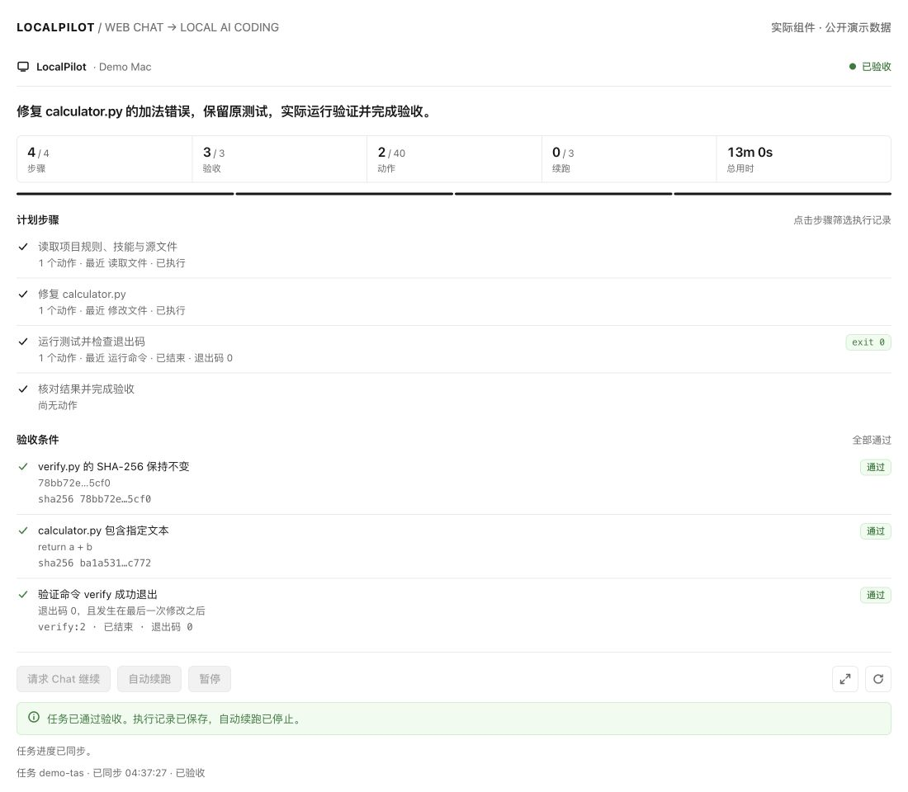
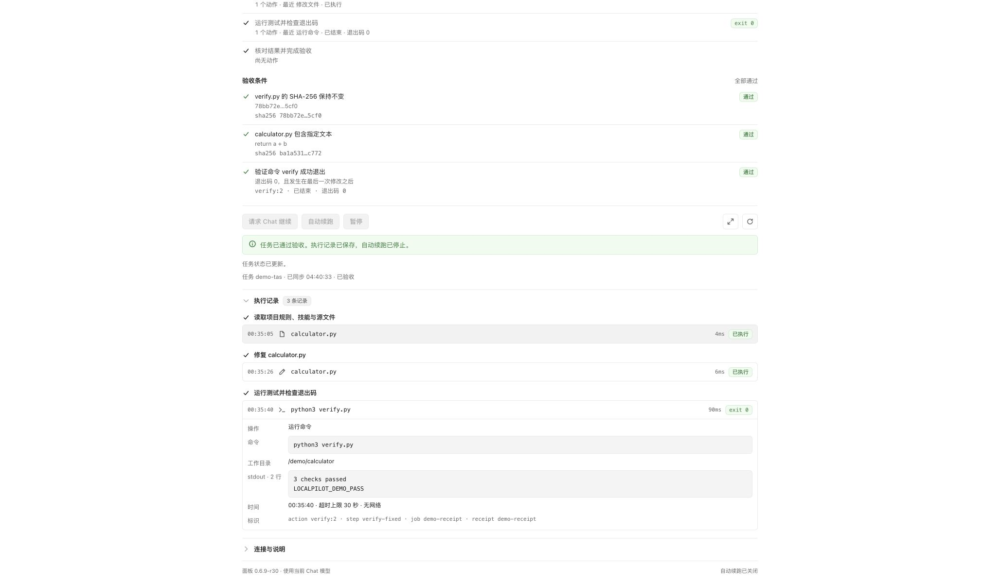
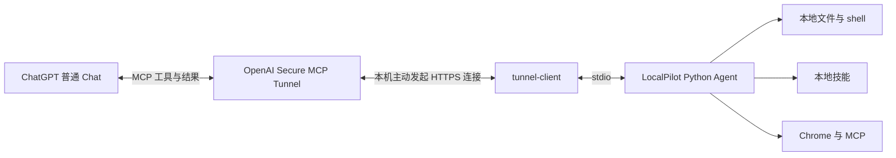

# LocalPilot

[English](README.md) · **简体中文**

[从安装到使用的完整教程](docs/WIKI.zh-CN.md)
**在 ChatGPT 网页普通 Chat 中，直接完成本机 AI Coding。**

让 ChatGPT 读取项目、理解本地技能、修改代码、运行测试，并把真实结果带回对话。沿用现有 Chat 的模型能力，LocalPilot 本身不接入额外模型 API、不启动 Codex，也不要求切到 Work。

[快速开始](#快速开始) · [Tunnel 图文教程](docs/TUNNEL.zh-CN.md) · [功能与配置](docs/USAGE.zh-CN.md) · [验证与边界](docs/VERIFICATION.zh-CN.md)



*截图来自实际 LocalPilot 面板，使用公开演示数据渲染；不是伪造的 ChatGPT 会话截图。*

## 为什么做这个

想修一个本地项目，却不想再开一个付费模型 API 或消耗另一套编码工具的用量？LocalPilot 把普通 Chat 和本机执行环境连起来：你在网页里说需求，模型按需调用本机工具，代码修改和测试发生在自己的电脑上。

“免费 AI Coding”的准确含义是：**LocalPilot 不收取软件使用费，也不主动产生额外模型 API 调用费用。** 如果你的账号已经包含可用的普通 Chat、开发者模式和 Tunnel 接入能力，就能利用这些现有权益做本地编码。Chat 的上下文、回复和工具结果仍使用 token；套餐、额度与接入资格仍由 OpenAI 决定，不能承诺所有 Free 账号可用或无限免费。详见 [用量说明](docs/USAGE.zh-CN.md#费用与-token)。

## 能做什么

| 能力 | 直接在对话里提出的需求 |
|---|---|
| 本地 AI Coding | “读取这个项目，修复失败测试，运行验证后告诉我改了哪里。” |
| 文件与终端 | 搜索内容、读写文件、精确替换、应用补丁，执行 shell 并取回退出码和日志 |
| 本地技能 | 发现 `.agents/skills`、`.codex/skills` 等目录，按任务读取 `SKILL.md`、引用文件及项目规则 |
| 图片处理 | 看懂本机图片，裁剪、缩放、旋转、调色；保存宿主交付的生成图片并读回 |
| 浏览器 | Chrome 页面快照、点击、输入、导航和截图；使用持久浏览器配置保留登录态 |
| 本机 MCP | 可选桥接已有 MCP 服务，复用你自己的工具配置 |
| 多步骤任务 | 保存计划、动作回执和验收条件；拒绝提前结项，支持暂停及有条件续跑 |



*实际面板的演示回执：命令、工作目录、退出码、输出和修改记录均可查看。执行任务不要求手动操作面板。*

## 如何连接



每位使用者自行部署 Agent、创建自己的私有 Tunnel。GitHub 提供源码，不提供连接到作者电脑的共享入口，也不是一个已经上架的公共插件商店服务。Secure MCP Tunnel 用于私有连接，公共商店发布有单独要求。[官方 Tunnel 说明](https://developers.openai.com/api/docs/guides/secure-mcp-tunnels)

## 快速开始

当前验证平台：**macOS + Python 3.12 + tunnel-client 0.0.14**。浏览器能力另需 Google Chrome；Windows/Linux 尚未完成端到端验证。

1. 确认你的 ChatGPT 账号能开启开发者模式，Platform 组织有创建及使用 Tunnel 的权限。没有这些入口时，先看 [接入条件与常见问题](docs/TUNNEL.zh-CN.md)。
2. 下载并准备本机运行环境：

```bash
git clone https://github.com/a252937166/LocalPilot.git
cd LocalPilot

# 使用已安装的 Python 3.12；如需安装，可运行 brew install python@3.12
python3.12 -m venv .venv
.venv/bin/python -m pip install -r requirements.txt
brew install openai/tools/tunnel-client

# 先用仓库提供的独立示例目录，或替换为你自己的项目目录。
.venv/bin/python scripts/localpilot.py init \
  --workspace "$PWD/examples/calculator" --device-label "My Mac"
.venv/bin/python scripts/localpilot.py install-runtime
```

`init` 默认只授权指定目录，shell 网络关闭。已有配置会保留；若以前装过 LocalPilot，先核对 `~/.config/localpilot/config.json` 的 workspace。读取跨目录文件、联网安装依赖、使用浏览器等需求见 [配置说明](docs/USAGE.zh-CN.md#权限与配置)。

3. 按 [Tunnel 教程](docs/TUNNEL.zh-CN.md) 创建 Tunnel、关联 ChatGPT 工作区并准备运行密钥，然后连接：

```bash
.venv/bin/python scripts/localpilot.py save-key
.venv/bin/python scripts/localpilot.py connect --tunnel-id tunnel_YOUR_ID
.venv/bin/python scripts/localpilot.py status
```

`save-key` 在本机终端隐藏输入。密钥用于 Tunnel 认证，不是让 LocalPilot 调用模型生成接口。确认 `process_running`、`healthy`、`ready` 均为 `true`。

4. 在 [ChatGPT Plugins](https://chatgpt.com/plugins) 创建自己的开发者连接：命名为 **LocalPilot**，连接方式选择 **Tunnel**，选择你刚创建的 Tunnel。操作入口随账号界面可能不同，详见教程。
5. 新开普通 **Chat / 聊天**，从工具菜单加入 LocalPilot，发送：

> 用 LocalPilot 修复 project 中 calculator.py 的 add。先读取项目规则和适用的本地技能；只修改 calculator.py，保留 verify.py。建立任务计划，实际运行 python3 verify.py，读回结果并完成验收。请报告退出码和 stdout，全程保持普通 Chat。

示例测试最初应该失败，修复后应输出 `3 checks passed` 和 `LOCALPILOT_DEMO_PASS`。这是实际改文件和执行测试，不是只返回一段建议代码。

## 更多使用方式

> 查看这个项目的目录结构和适用技能，先解释你准备修改的文件，再修复问题并运行测试。

> 读取桌面上的 sample.png，顺时针旋转 90 度，另存为 sample-rotated.png，保留原图并读回确认。

> 用浏览器打开我指定的网页，读取页面信息；遇到登录时告诉我在 LocalPilot 的 Chrome 窗口完成登录。

> 恢复任务 `<task_id>`，先核对已有文件和执行回执，再完成剩余步骤。

## 当前状态

版本 **0.7.6**。补齐浏览器本地文件 URL、链接文件、内嵌本机页面和截图期间跳转的检查，并包含网页专用图标。**667/667 项本地回归通过**，其中包含独立 Chrome 测试。此前普通 Chat 已完成技能加载、代码/文本修改、图片旋转、真实验证和结项；本次补丁未重跑普通 Chat 验收。[验证详情](docs/VERIFICATION.zh-CN.md)

普通 Chat 仍决定何时调用工具及结束一轮。LocalPilot 能拒绝“验收未过却结项”，不能给 Chat 安装真正的 Stop hook，也不保证一小时无人干预工作。生成式改图还依赖宿主生图能力及文件交接，不能把本机旋转测试当成生成式编辑保真度通过。

## 开发与自测

```bash
.venv/bin/python scripts/check.py
# 已安装 Google Chrome 时，追加浏览器与面板检查
.venv/bin/python scripts/check.py --browser
```

测试使用临时目录、模拟服务和演示网页，不调用模型 API。原始结果保存在被 Git 忽略的 `verification/`。演示页面与截图来源见 [演示说明](docs/DEMO.zh-CN.md)。

升级时先结束或暂停重要任务，再执行 `git pull`、`stop`、`install-runtime`、`connect`。工具定义变化后刷新 ChatGPT 连接元数据，重新开 Chat 验证。详见 [运行维护](docs/USAGE.zh-CN.md#启动停止与升级)。

LocalPilot 是独立项目，与 OpenAI 无隶属关系。当前仓库未指定开源许可证；第三方依赖遵循各自许可证。问题反馈请使用 [GitHub Issues](https://github.com/a252937166/LocalPilot/issues)，不要附上密钥、Cookie、私人文件或未经脱敏的完整日志。
